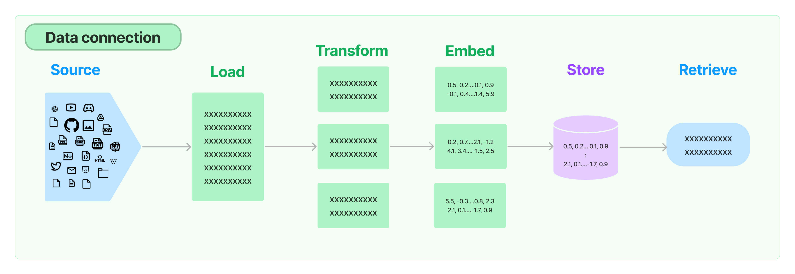

# Course Assistant Bot

### Developed by Reggie Bain
### [Click here to try our Syllabus Analyzer Streamlit App](https://course-assistant-bot.streamlit.app/)
## Overview
#### Background
This project is a proof of concept of what we envision as a broad class of AI-based assistant for course development. It focuses on a tool for building effective course syllabi, which serve a variety of key functions in course development. MIT's Teaching and Learning Lab (referencing Slattery and Carlson (2005)), for example, outlines 3 goals for a syllabus include the document being (1) motivational, (2) structural, and (3) evidentiary. The syllabus can not only serve to outline the key components of the course, but also serves as a sort of "contract" between the students and the instructional staff. In recent years, the rise of AI use in educational contexts (and resulting issues with academic integrity violations) has made the contract aspect of syllabi particularly important. Course policies must be enforced equitably and worded clearly, particularly in [cases where litigation could be involved](https://apnews.com/article/high-school-student-lawsuit-artificial-intelligence-8f1283b517b2ed95c2bac63f9c5cb0b9). 

This tool is an example of a simple suite of tools that can help instructors, departments, or colleges to quickly assess, among other course resources, how effective syllabi are at answering student questions by actually simulating asking those questions using Large Language Models (LLMs) and so-called Retrieval Augmented Generation (RAG). In short, RAG is a process of providing queries to LLMs that are supplemented with semantically relevant context from source material. Source material could range from scraped internet resources from Wikipedia to aid in more general questions to specific documents/databases that user's may want to query for precise details. We will be exploring the latter in an effort to allow LLMs to provide accurate and precise answers to important questions students and others have about college courses.
#### KPIs
1. Build Retrieval Augmented Generation (RAG) pipeline for asking questions of syllabi
2. Assess/evaluate the pipeline using 2 methods (1) LLMs + Synthetically generated Q&A set and (2) By hand generated Q&A set where the answers are known.
3. Construct basic app that effectively allows users to query documents.
#### Stakeholders
1. Instructors, departments, and colleges that have incentive for courses to have effectively constructed syllabi
2. Students, who will be better able to understand expectations of them (grading policies, resources needed) in courses.
3. Administrators at universities and/or legal teams who want to assess syllabi from a "contract" point of view.
[Click here for write up](https://docs.google.com/document/d/1TLx1REQPteNJ01rnNXXXq0XGCFc9cZoriAiHYC5Np24/edit#heading=h.fcffuc5owalc)
#### Modeling Approach
We followed the RAG modeling and evaluation system design [outlined here by HuggingFace](https://huggingface.co/learn/cookbook/en/rag_evaluation) as shown in the diagram below (courtesy HuggingFace). In short, a document is divided into chunks and embedded as high dimensional vectors. Queries from the user are embedded using the same model and then compared to the chunk embeddings of the source document. The RAG pipeline identifies the k most semantically relevant chunks (sometimes performing some so-called *reranking*) and feeds this as *context* along with the query to another LLM.

[Click here for write up](https://docs.google.com/document/d/16rt5T4E6p_cVWof3mqoyO5XgBXt_k8VFKqReElIY_DQ/edit?usp=sharing)
## Data
Our RAG pipeline was tested on several real course syllabi from college-level courses. Although we would have liked to test on a wide variety of types of courses in different subjects and formats (we only had permission to use a physics syllabus from a residential STEM high school and a computer science course at Northwestern University), the pipeline should easily generalize to any reasonably formatted syllabus (or other course document/resource). [In our document store](./documents), you'll find two different formats for a syllabi, one in Markdown and one as a PDF. The pipeline works robustly for both of these formats, but should also work for HTML format. You'll also find JSON files of key sets of questions we tested on each syllabus where we knew the answers were contained in the documents. We explore this more below.
## Embeddings
We used the General Text Embeddings model from HuggingFace's library (https://huggingface.co/thenlper/gte-small) using the small version for practical purposes. This model creates vector embeddings of the document, which is split into a number of chunks. First, we used LangChain and the GTE-Small model to create splits after tokenizing. Atlhgouh the easiest way to split a document into chunks by a simple character count/chunk size, using a tokenizer-based splitter allows for a more semantically relevant division of the document into relevant sections/paragraphs/sentences. 

*The diagram above, courtesy of LangChain [7], shows a diagram of the vector embedding  process*

Many different models could be used for creating embeddings, but this model was generally recommended as high-performing for open-source, small models. 
## Retrieval
Using LangChain, we create a small vector store using [Facebook AI Similarity Search (FAISS)](https://ai.meta.com/tools/faiss/) for indexing/searching. This allows us to store embeddings of our source documents and quickly search through them when given a query to find the most semantically relevant context. This process is called "retrieval" and relies on comparing the cosine similarity of an embedded query with the vector embeddings of the chunked source material. A diagram of the retrieval process (courtesy of Langchain) is shown below:

## LLMs
We experimented with a variety of LLMs but ultimately used the following, which according to various benchmarks, perform well for the tasks for which they were used in our pipeline.
- Embeddings: [General Text Embeddings - Small](https://arxiv.org/abs/2308.03281)
- Synthetic Question Generation: [Mixtral-8x7B-Instruct](https://huggingface.co/mistralai/Mixtral-8x7B-Instruct-v0.1)
- Q&A with Context: [Zephyr 7B $\beta$](https://arxiv.org/abs/2310.16944)
- Q&A with Context: [Llama 3.1-8B](https://huggingface.co/meta-llama/Llama-3.1-8B)
- LLM as Judge Agent: [GPT-4-1106-Preview](https://platform.openai.com/docs/models)
## Results
#### LLM Evaluation of Q&A Pairs
We evaluated our RAG pipeline using the following process based on the procedure outlined by the HuggingFace team [found here](https://huggingface.co/learn/cookbook/en/rag_evaluation):
1. Generate synthetic Q&A dataset using an LLM to generate questions based on the source documents
2. Feed synthetic dataset to LLM to get answers for each question
3. Use LLM to evaluate several metrics: "groundedness", "relevance", and "standalone" based on definitions of key metrics [here](https://docs.ragas.io/en/latest/concepts/metrics/overview/) and [here](https://arxiv.org/abs/2312.10003).
4. Construct prompt to evaluate the answers based on the questions and source documents using a more powerful LLM as *judge agent*
We evaluated several syllabi, scoring the synthetically generated Q&A pairs which can be found [here for our markdown pipeline](out/rag_eval_results_md/working/generated_qa.csv) and [here for our pdf pipeline](out/rag_eval_results_pdf/working/generated_qa.csv). We kept only Q&A pairs where the question had a groundedness, relevance, and standalone of at least 1. The LLM prompts for these criteria [can be found here](src/rag-eval.ipynb). This, unfortunately, cut out some questions that yield reasonable results when plugged into our RAG pipeline (for example using our Streamlit app). One example was the question *What platform do students use to submit homework assignments and complete in-class tests?* for the PDF syllabus in our document store. While this was cut, when plugged into our Streamlit app, the RAG pipeline output generally includes the term *WebAssign*, which is indeed correct. However, we felt the process of culling questions based on widely used metrics was important for establishing a verification procedure for our RAG system.

At this point we were left with a dataframe of questions, true answers (based on how the original synthetic question was formed from the source document), and generated answers (made using the full RAG pipeline with a different LLM). Using the best LLM to whose API we had easy access to, GPT-4-1106-Preview, we submitted each question, generated answer, and true answer triplet and generated scores representing the correctness of the generated answer based on the true answer. We submitted each triplet along with a detailed evaluation prompt that can be found in our notebook [here](src/rag-eval.ipynb) and from HuggingFace [here](https://huggingface.co/learn/cookbook/en/rag_evaluation). Scores ranged from 1-5 and were based on the correctness of the answer based on the source material. The distribution of the scores we found are shown below.

Overall, these results are quite good, with the majority of RAG model's responses receiving a 5/5 score from the judge agent (GPT4)! **NOTE:** When using open-source models and free-tier resources, we were severely rate limited, often having to wait 12 hours to submit additional queries even when using techniques for web scraping. We decided to at least generate 1 synthetic question per semantically distinct portion of the source material as found by the embeddings model. With additional resources, this exact pipeline could easily generate hundreds of synthetic questions.
#### Baseline Comparison
We considered a number of options for a baseline model including a rule-based keyword search, human evaluation of the Q&A set, randomly guessing text that could answer a question, and bag-of-words similarity search (via TF-IDF), among others. However, we decided to compare our RAG pipeline with a model that directly uses an LLM without any document retrieval. 

This approach will have obvious limitations based on the specific questions asked and so creating a question set to compare our RAG pipeline with is tricky. Modern state-of-the-art LLMs will be able to provide excellent answers to general questions such as: 
- *How can I study for tests in computer science?*
- *What are some online resources I can use to help me study for intro physics?*
- *What information should my syllabus include?*

However, anything more specific (which will be most questions students will have about a course) will require more specific context. Questions that the syllabus should (and an LLM will be able to handle via RAG) be able to answer include:
- *What textbook is needed for the course?*
- *What is the grading policy for this course?*
- *How many tests and labs will I have to complete?*

We took some questions that we generated to ask syllabi in [this notebook](src/rag-eval.ipynb) and combined them with some more general questions we thought an LLM could answer without context that could be important for a syllabus to answer. To be more fair to the baseline, we fed these questions to GPT-4o (200+B parameters) which has far more parameters than Zephyr-8B and should thus provide better answers to general questions. The results can be found below:

| Question | Generated Answer | Score |
|---|---| --- |
| What is the grading range for an F grade in the Graduate course? | Cannot answer. | 0 |
| How many extensions can a student request for assignments during the quarter?    | Cannot answer. | 0 |
| What is programming used for? | Programming is used to instruct computers to perform specific tasks, solve problems, and automate processes. | 5 |
| Who are the people that can be found in the course staff? | Cannot answer. | 0 |
| What is the primary textbook for the course?  | Cannot answer. | 0 |
| What should students bring to the exam according to the instructor? | Cannot answer.  | 0 |
| How many college credit hours can students earn in the General Physics I course? | Cannot answer. | 0 |
| What is the purpose of edSTEM?                                                   | Cannot answer. | 0 |

Using GPT4, you can notice that generic questions such as "What is programming used for?" can certainly be answered by an LLM without RAG for retrieving context. However, any question that requires any specificity whatsoever can't be answered. **Our RAG model is a vast improvement over the baseline!**
## Conclusions
We achieved our KPIs by building and evaluating a RAG pipeline to evaluate syllabi by asking it questions that can be automatically generated by an LLM and then evaluating the subsequent answers using another LLM. We also created an app prototype that can take uploaded HTML, PDF, and Makrdown format syllabi and generate question and answer pairs to test how many relevant questions syllabi can answer.
## Future Work
#### Open Source vs. Proprietary LLMs, APIs, and Hyperparameters
There are a number of ways we would like to advance this work. The biggest log jam is the use of open source, small models that can be run locally and without high API costs. The one proprietary LLM we used was [OpenAIs gpt-4-1106-preview model](https://platform.openai.com/docs/models), a state-of-the-art model that was used for evaluating the responses to the synthetically generated Q&A sets we created in our [evaluation notebook found here](./src/rag-eval.ipynb). With additional resources, we would want to use the highest quality LLMs for the tasks of embeddings, Q&A, synthetic Q&A generation, etc that are available as found here on the [Hugging Face Leaderboard](https://huggingface.co/spaces/open-llm-leaderboard/open_llm_leaderboard). More resources, especially so as to avoid rate limiting, would also allow us to explore a larger space of hyperparamters such as chunk-size (here we only used 200, embedding models, judge agents) and generate a much larger spectrum of synthetic questions with which to test our pipeline.
#### Compute + Storage
Our intention is to productionalize this application. This will require cloud computing resources through a service such as AWS. For the purposes of this project, we decided to focus first on free-tier resources. Our plan is the following:
1. Use Amazon Redshift and/or DocumentDB services for vectorstores of embedded files.
2. Use AmazonS3 instances or HuggingFace Endpoint (Pro tier) to store high-parameter, high-performing LLMs.
3. Build AWS Glue scripts to manage databases and connect with UI for performing RAG.
Since we're, for the time being, releasing the app via Streamlit cloud-hosting to the public, we did not yet implement non open source cloud computing resources, although it is our plan to ultimately do so.
#### Additional Use Cases
Going forward, we feel that AI-driven course module building tools can be a valuable tool for instructors, students, and administrators. Our next goal is to extend this RAG pipeline and suite of tools to course content, including open-source textbooks and the notes/lectures of individual professors. The existing pipeline CAN already do this for notes that are embedded in HTML, Markdown, of PDF format. The content of Google Slides can already easily be exported to HTML. Why do this? Because this technique could allow instructors (and ultimately students) to interact with courses via LLMs that protect their intellectual property/data. In our opinion, the proptection of instructors IP is a huge road block to a broader use of AI within courses. We are developing our work into a self-contained python-based application that would allow instructors to do this.
## References
[1] https://tll.mit.edu/teaching-resources/course-design/syllabus/

[2] https://apnews.com/article/high-school-student-lawsuit-artificial-intelligence-8f1283b517b2ed95c2bac63f9c5cb0b9 

[3] https://huggingface.co/thenlper/gte-small 

[4] https://platform.openai.com/docs/models 

[5] https://huggingface.co/spaces/open-llm-leaderboard/open_llm_leaderboard

[6] https://ai.meta.com/tools/faiss/

[7] https://python.langchain.com/docs/concepts/embedding_models/

[8] https://huggingface.co/learn/cookbook/en/rag_evaluation 

[9] https://arxiv.org/abs/2308.03281 

[10] https://arxiv.org/abs/2310.16944

[11] https://python.langchain.com/v0.1/docs/modules/data_connection/

[12] https://docs.ragas.io/en/latest/concepts/metrics/overview/

[13] https://arxiv.org/abs/2312.10003
